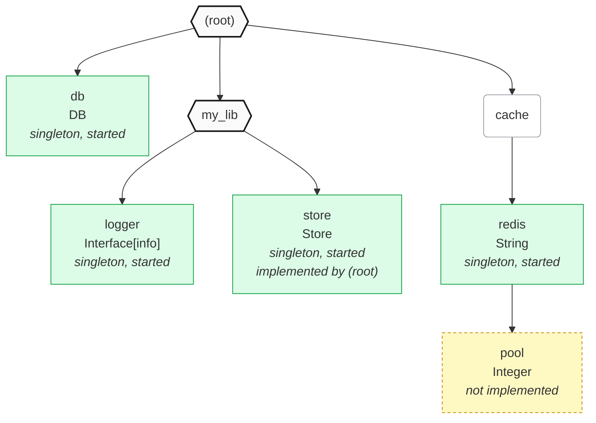
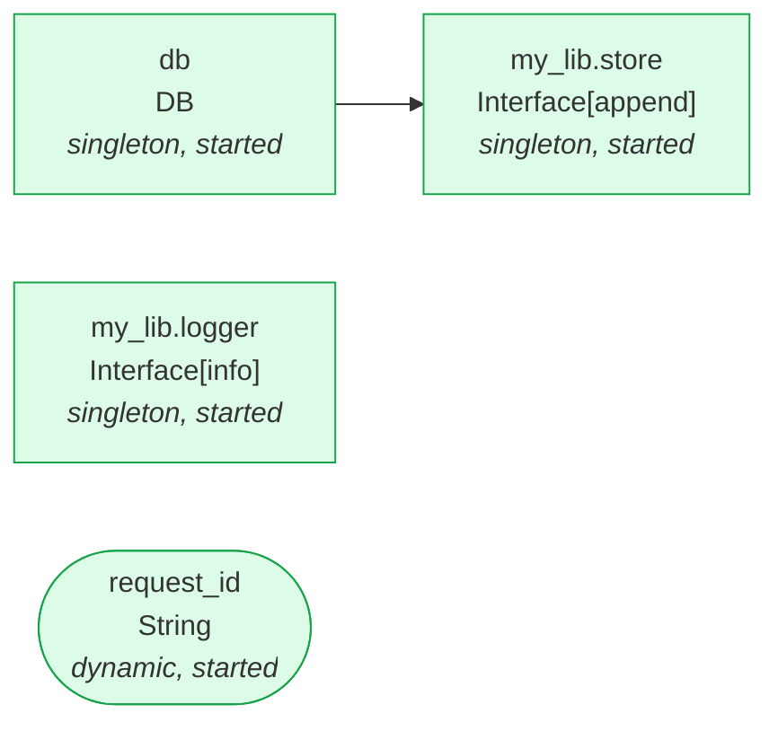

# Sourced::Component

Configuration as a tree of typed components, with dependencies and a managed lifecycle.

Every node in the tree is a `Sourced::Component`. A node can declare a type, be implemented with dependencies and lifecycle hooks (`prepare`, `build`, `start`, `teardown`), and have subcomponents of its own. Libraries declare their own root components; applications mount them under a namespace, and implement or override their subcomponents.

```ruby
require 'sourced/component'

App = Sourced::Component.new

# 1. Declare what the component has, and the types values must satisfy
App.declare('db.url', String) { 'sqlite://app.db' } # with a default implementation
App.declare('db', DB)

# 2. Implement components, with dependencies and lifecycle hooks
App.component!('db', ['db.url']) do
  build { |url| DB.new(url) }
  start { |db, _context| db.connect }
  teardown { |db| db.disconnect }
end

# 3. Boot
App.start!

# 4. Read values, or inject them into your classes
App['db'] # => #<DB ...>

class Repo
  include App.inject('db')
end
Repo.new.db # => #<DB ...>

# 5. Shut down
App.teardown!
```

## Installation

Add the gem to your application's Gemfile:

```ruby
gem 'sourced-component'
```

Requires Ruby 3.2+. Types are [Plumb](https://github.com/ismasan/plumb) types.

## Declaring components

`#declare(key, type = Any, &default)` adds a typed node to the tree. Values are parsed through the declared type when they're built, so a component that builds the wrong thing fails the boot.

```ruby
T = Sourced::Component::T # Plumb::Types

App.declare('logger', T::Interface[:info, :debug])
App.declare('settings.retries', Integer)
App.declare('cache', T::Interface[:get, :set].nullable) # optional, by type
App.declare('anything')                                 # Any
```

A block is a default implementation: a singleton built once, with no dependencies. It can be replaced with `#component!` or `#component`.

```ruby
App.declare('logger', T::Interface[:info]) { Logger.new($stdout) }
```

### Nested keys

Dot-separated keys build the tree. Missing intermediate segments are created as *namespaces*: nodes without a type or an implementation, which are skipped by the lifecycle.

```ruby
App.declare('sourced.db.logger', Logger)
# App
# └── sourced        (namespace)
#     └── db         (namespace)
#         └── logger (Logger)
```

A component can keep declaring under the nodes it created, and can give a namespace it created a type later, so it becomes a component with a value of its own:

```ruby
App.declare('db.url', String) { 'sqlite://app.db' }
App.declare('db', DB) # 'db' was a namespace, now it's a component too
App.component!('db', ['db.url']) { build { |url| DB.new(url) } }
```

Declaring a key twice raises `DeclarationOverrideError`.

## Implementing components

`#component!(key, deps = [], provider = nil, &block)` implements a declared node as a singleton, with a block of lifecycle hooks or a [provider](#providers). Dependencies are keys of other components, and their values are passed to `build`, in order.

```ruby
App.component!('db', ['db.url', 'logger']) do
  prepare { require 'sequel' }                   # before anything is built
  build { |url, logger| Sequel.connect(url, logger:) } # returns the component's value
  start { |db, context| }                        # after everything is built
  teardown { |db| db.disconnect }                # on shutdown, in reverse order
end
```

All hooks are optional. Hooks can also be any callable, and the block can take the DSL as an argument instead of being evaluated in it:

```ruby
App.component!('clock') { build(-> { Time }) }
App.component!('db', ['db.url']) { |c| c.build { |url| DB.new(url) } }
```

Implementing a node again replaces its implementation (the last one wins), including declared defaults. Dependencies can be declared after the component that uses them: they're resolved when the component is prepared.

### Singleton and dynamic components

- `#component!` implements a singleton: built once on `#build!`, and memoized.
- `#component` implements a dynamic component: built on every read, ex. a per-request value. Dynamic components take the same deps and hooks, and still go through `prepare`, `start` and `teardown`, with a `nil` value.

```ruby
App.declare('request_id', String)
App.component('request_id') { build { SecureRandom.uuid } }

App['request_id'] # => "8d1c..."
App['request_id'] # => "f30a..."
```

### Configs

`#config!` and `#config` are shortcuts for components that only have a build step. The block builds the value, and gets the dependencies' values:

```ruby
App.config!('foo.bar') { 10 }                                # singleton
App.config!('with.deps', ['sourced.db']) { |db| Foo.new(db) } # singleton, with deps
App.config('now') { Time.now }                               # dynamic: built on every read
```

They're the same as:

```ruby
App.component!('with.deps', ['sourced.db']) { build { |db| Foo.new(db) } }
App.component('now') { build { Time.now } }
```

### Providers

Instead of a block, `#component!` and `#component` take a provider that implements the component. A provider is either:

- **a callable**, called with the dependencies' values as the build step:

  ```ruby
  class DBFactory
    def self.call(url) = DB.new(url)
  end

  App.component!('db', ['db.url'], DBFactory)
  App.component!('clock', -> { Time })                # no dependencies
  App.component('request_id', -> { SecureRandom.uuid }) # dynamic
  ```

- **or an object with `#builder_for(node)`**, which returns that callable for the node it's implementing. Use it for providers that need to know about the node, ex. its `type` or `path`. `Sourced::Component::ENVProvider` is one:

  ```ruby
  App.component!('user.email', Sourced::Component::ENVProvider.new('USER_EMAIL'))
  App.component!('user.info', Sourced::Component::ENVProvider.new(/^USER_/, :downcase))
  App.component!('everything', Sourced::Component::ENVProvider) # all variables
  ```

The callable (the provider itself, or what `#builder_for` returns) can also implement any of `#prepare`, `#start(value, context)` and `#teardown(value)`, which become the component's other lifecycle hooks. Hooks it leaves out are skipped, so plain lambdas only build. A provider can supply a whole lifecycle:

```ruby
class PoolProvider
  def self.builder_for(node) = new(node)

  def initialize(node) = @node = node
  def call(url) = Pool.new(url, name: @node.path) # build
  def start(pool, _context) = pool.connect
  def teardown(pool) = pool.close
end

App.component!('db.pool', ['db.url'], PoolProvider)
```

Provided values are parsed through the declared type, like any other. Passing both a provider and a block raises `ArgumentError`, and so do a provider that responds to neither `#call` nor `#builder_for`, and a `#builder_for` that doesn't return a callable.

### ENV components

`#env` implements singleton components built from ENV variables. Values are decoded into each declared type with [`Plumb::Codec::Forms`](https://github.com/ismasan/plumb), the codec for string input (`'3000'` → `3000`, `'true'` → `true`, `'1977-11-29'` → a `Date`). It maps ENV variables, or regexes matching them, to component keys:

```ruby
# ENV: USER_EMAIL=me@example.com USER_NAME=Ismael USER_DOB=1977-11-29 APP_PORT=3000

App.declare('user.email', T::Email)
App.declare('app.port', Integer)
App.declare('user.info', T::Data[name: String, dob: Date])

# Single variables
App.env('USER_EMAIL' => 'user.email', 'APP_PORT' => 'app.port')

# Variables matching a regex, collected into a hash and decoded into a struct
App.env(:downcase, /^USER_/ => 'user.info')

App.start!
App['user.email'] # => "me@example.com"
App['app.port']   # => 3000
App['user.info']  # => #<User name="Ismael" dob=1977-11-29>
```

| Call | Reads |
| --- | --- |
| `env('USER_EMAIL' => 'user.email')` | the `USER_EMAIL` variable |
| `env(/^USER_/ => 'user.info')` | variables matching the regex, into a hash, with the match removed: `USER_NAME` → `NAME` |
| `env(:downcase, /^USER_/ => 'user.info')` | the same, with modifiers applied to the names: `USER_NAME` → `name` |
| `env('user.info')` | all variables, into a hash |
| `env(:downcase, 'user.info')` | all variables, with modifiers |

- **Collecting into a hash:**
  - The matched part is removed from each name, then modifiers are applied (only `:downcase` so far). Names left empty are skipped.
  - The hash is decoded into the declared type, and variables that aren't attributes are ignored. Keys come out as the type expects them: symbols for `Data` structs, `Hash[name: …]` schemas and `Hash[Symbol, …]` maps, and strings for `Hash[String, …]` maps and string-keyed schemas.
  - **The declared type must take a hash:** a `Hash` schema or map, or a `Data` struct, including nullable ones, ones with defaults, or unions with a hash branch. This is checked when `#env` is called, so `env(/^USER_/ => 'user.email')` with a `String` type raises `ArgumentError` right away, suggesting a single variable instead.
- **Modifiers only apply when collecting** with a regex, or all variables. Using one with a single variable raises `ArgumentError`, and so does an unknown modifier.
- **Prefer a regex to collecting everything.** ENV is shared by the whole process, so `env(:downcase, 'user.info')` would read a `user` or `home` attribute from the system's `USER` or `HOME`.
- **One call can map several sources,** ex. `env(:downcase, /^USER_/ => 'user.info', /^APP_/ => 'app.settings')`. Every source, key and type is checked before any component is implemented.
- **ENV is read on `#build!`,** not when `#env` is called.
- **Keys are relative to the component** `#env` is called on, like `#component!`. An app can implement a mounted library's components from ENV: `App.env('DB_URL' => 'my_lib.db.url')`.
- **Untyped components** (declared without a type, so `Any`) get raw strings: the variable's value, or a hash of them with string keys.
- **Missing or invalid variables fail the build** with `Sourced::Component::ENVProvider::Error` (a `Plumb::ParseError`) naming the component and each variable. Values are left out of the message, since ENV often holds secrets. Use a nullable type, an optional attribute or a default if a variable may be absent.

  ```
  invalid ENV for user.email: USER_EMAIL is missing

  invalid ENV for user.info:
    USER_DOB is invalid: Must match /\A\d{4}-\d{2}-\d{2}\z/
    email is missing from ENV variables matching /^USER_/
  ```

  If a missing attribute matches a variable in a different case, the message suggests `:downcase`.

Under the hood, `#env` implements components with [`ENVProvider`](#providers), which can also be used directly, ex. for a dynamic component that reads ENV on every read: `App.component('flag', Sourced::Component::ENVProvider.new('FLAG'))`.

See [examples/env.rb](examples/env.rb).

## Reading values

`#[]` reads a component's value by key, once the component is built.

```ruby
App['db']
App['settings.retries']
App.node('db')       # the node itself, a Sourced::Component
App.declared?('db')  # => true
```

Reads don't lock, and raise:

- `NotBuiltError` before the component is built
- `UndeclaredComponentError` for unknown keys, or for namespaces, which have no value

Values stay readable after teardown.

## Lifecycle

The root component drives the lifecycle of the whole tree. Each step runs the matching hook of every component, in dependency order (dependencies first), and moves every component to a new status:

| Method | Does | Status |
| --- | --- | --- |
| `#prepare!` | Checks the tree (see below), sorts components by dependency, runs `prepare` hooks | `:prepared` |
| `#build!` | Builds singletons and parses their values through their types | `:built` |
| `#start!(context = Thread.current)` | Runs `start` hooks with `(value, context)` | `:started` |
| `#teardown!` | Runs `teardown` hooks with `(value)`, in reverse order | `:toredown` |

Each step runs the ones before it if needed (`#start!` prepares and builds), and is idempotent. `#teardown!` is a no-op unless the component is started. `:toredown` is terminal: `#start!` on a torn down component raises `TornDownError`.

```ruby
App.boot_status          # => :started, the root's status
App.node('db').status    # => :started, a component's status
App.ordered_nodes        # components in dependency order, once prepared
```

`#prepare!` raises:

- `UnimplementedComponentError` for declared components without an implementation, listing every one
- `MissingDependencyError` for dependencies that aren't declared, or that are namespaces without an implementation
- `CircularDependencyError` for dependency cycles

Once prepared, the tree is locked: declaring, implementing or mounting anything raises `LockedComponentError`.

### Long-running components

`start` hooks run while holding the root's lock, so components that do long-running work (workers, servers, pollers) should spawn a thread or fiber and return. The context passed to `#start!` (the current thread by default) can be used to spawn work in a particular place, ex. an Async task.

```ruby
App.declare('worker', Worker)
App.component!('worker', ['db']) do
  build { |db| Worker.new(db) }
  start { |worker, _context| worker.start } # spawns a thread and returns
  teardown { |worker| worker.stop }         # signals the thread, and joins it
end

App.start!
trap('TERM') { Thread.main.raise(Interrupt) }
begin
  sleep # components run in their own threads
rescue Interrupt
ensure
  App.teardown!
end
```

Components that depend on others start after them and are torn down before them, so a producer that depends on a worker never pushes work to a stopped worker. See [examples/tree.rb](examples/tree.rb).

### Errors while starting and tearing down

- If a `start` hook raises, the components already started are torn down in reverse order, the component is left `:toredown`, and the error is re-raised.
- If `teardown` hooks raise, every component is still torn down, and the first error is re-raised.

## Mounting components

A library can declare its components in its own root component, with default implementations:

```ruby
module MyLib
  def self.component
    @component ||= Sourced::Component.new.tap do |s|
      s.declare('logger', T::Interface[:info]) { Logger.new($stdout, progname: 'my_lib') }
      s.declare('store', Store)
      s.component!('store', ['logger']) { build { |logger| MemoryStore.new(logger:) } }
    end
  end
end
```

An application mounts it under a namespace with `#mount(key, mountable)`, which attaches the library's root component as a branch of the app's tree. The app reads its components under the namespace, and can implement (or re-implement) them:

```ruby
App.declare('db', DB) { DB.new }
App.mount('my_lib', MyLib.component)

# Override the library's store, with the app's db
App.component!('my_lib.store', ['db']) { build { |db| DBStore.new(db) } }

App.start!
App['my_lib.store']    # => #<DBStore ...>
MyLib.component['store']  # => the same object
```

Mounted components aren't copied. The tree is made of the same node objects, so the library reads the app's overrides through its own keys, ex. from classes that only know about `MyLib.component`.

Keys can be nested (`App.mount('libs.my_lib', MyLib.component)`), components can mount other components, and a mounted component can keep declaring components: every ancestor indexes them.

### Mountables

`#mount` takes anything that implements `#to_component`, returning a `Sourced::Component`. Components implement it, returning themselves, and a library can implement it so apps mount the library itself:

```ruby
module MyLib
  def self.to_component = component
end

App.mount('my_lib', MyLib)
```

`#mount` raises `ArgumentError` for objects that don't respond to `#to_component`, or whose `#to_component` doesn't return a `Sourced::Component`.

`#component!` and `#component` mount components too: given anything that implements `#to_component`, they're an alias to `#mount`.

```ruby
App.component('my_lib', MyLib) # same as App.mount('my_lib', MyLib)
```

Mounting takes no provider or block, so passing either along with a component raises `ArgumentError`.

### Dependencies are relative to the implementing component

Dependency keys are resolved from the component that called `#component!` (or `#component`):

- The library's `component!('store', ['logger'])` depends on `my_lib.logger`.
- The app's `component!('my_lib.store', ['db'])` depends on the app's `db`.

So a library's implementations can only depend on components in its own tree, and an application wires library components to its own components by overriding them.

### Ownership

Components own their declarations and the sub-trees under them. Any component can implement any node below it, but can only declare under nodes it declared itself:

```ruby
App.declare('my_lib.extra', String)
# => Sourced::Component::OwnershipError: my_lib is owned by my_lib: declare it there. This component can only implement it
```

The root of the tree owns the lifecycle. Booting a mounted component directly (`MyLib.component.start!`) raises `SubcomponentError`: boot the root.

`#mount` raises if the component (what `#to_component` returns) is already mounted somewhere, is the root of the tree it's being mounted into, isn't open, or if the key is taken.

## Dependency injection

`#inject(*keys)` builds a module that injects components into a class, as keyword arguments to `#initialize` with readers. Each one defaults to the component's value, read when the object is instantiated.

```ruby
class Dispatcher
  include App.inject('logger', 'my_lib.store')

  def dispatch(event)
    store.append(event)
    logger.info("dispatched #{event}")
  end
end

Dispatcher.new.store                   # => App['my_lib.store']
Dispatcher.new(store: FakeStore.new)   # any dependency can be passed explicitly, ex. in tests
```

- Kwargs are named after the last segment of each key (`'my_lib.store'` => `store`). A hash gives them custom names: `App.inject('my_lib.store' => 'st')`.
- Keys are relative to the component `#inject` is called on: `App.node('my_lib').inject('store')`.
- Injections compose: a class can include several, and keep its own `#initialize` (positional and keyword arguments are passed through). Subclasses inherit them.
- Values are read on instantiation, so classes can be defined before the component is built, and dynamic components give each object a fresh value. Instantiating before the component is built raises `NotBuiltError`.
- Injecting an undeclared key raises `UndeclaredComponentError`, and injecting two components under the same name raises `ArgumentError`.

Injectors hold on to the nodes themselves, so a library's classes can inject from the library's own root component, and get the overrides of the application that mounts it:

```ruby
module MyLib
  class Dispatcher
    include MyLib.component.inject('store')
  end
end

App.mount('my_lib', MyLib.component)
App.component!('my_lib.store', ['db']) { build { |db| DBStore.new(db) } }
App.start!

MyLib::Dispatcher.new.store # => #<DBStore ...>, the app's override
```

## Inspecting the tree

```ruby
App.index.keys
# => ["db", "my_lib", "my_lib.logger", "my_lib.store"]

App.node('my_lib.store')
# => #<Sourced::Component my_lib.store Store (singleton, started)>

node = App.node('my_lib.store')
node.path            # => "my_lib.store"
node.key             # => "store"
node.parent          # => the my_lib component
node.root            # => App
node.owner           # => the component that declared it
node.type            # => the declared type
node.implementation  # => deps, mode (:singleton or :dynamic) and the implementing component
node.children        # => { segment => Component }
node.namespace?      # => no type and no implementation
```

### `#tree`

Returns a `Sourced::Component::Tree` of the components under a component: how components are nested, which components are mounted, and who declared and implemented each one. (`#graph`, below, shows how components depend on each other instead.)

```ruby
puts App.tree
```

```
(root)
├── db DB (singleton, started)
├── my_lib [mounted]
│   ├── logger Interface[info] (singleton, started)
│   └── store Store (singleton, started) implemented by (root)
└── cache
    └── redis String (singleton, started)
        └── pool Integer (not implemented, open)
```

- **Mounted components** are marked `[mounted]`, and namespaces (no type, no implementation) are shown by their key alone.
- **`implemented by`** marks components implemented by a component other than the one that declared them, ex. an app overriding a library's component. `(root)` is the root of the tree.
- **Called on a mounted component,** it renders only the tree under it: `MyLib.component.tree`.

`tree.root` is a `Tree::Node`, with `#children`, and `tree.to_h` returns nested hashes:

```ruby
tree = App.tree
tree.status # => :started, the root's status
tree.root.children.map(&:key) # => ["db", "my_lib", "cache"]

store = tree.root.children[1].children[1]
store.key          # => "store"
store.path         # => "my_lib.store"
store.type         # => the declared type
store.type_name    # => "Store"
store.namespace    # => false
store.mounted      # => false, true for mounted components
store.implemented  # => true
store.mode         # => :singleton
store.status       # => :started
store.owner        # => "my_lib", the full path of the component that declared it (nil for the root)
store.implementer  # => nil, the full path of the component that implemented it (nil for the root)
store.overridden?  # => true: implemented by a component other than its owner
store.children     # => []
```

`Tree#to_mermaid` returns a top-down [Mermaid](https://mermaid.js.org) flowchart of the tree:

```ruby
puts App.tree.to_mermaid
```



- **Edges point from each node to its children.**
- **Components** (the root of the tree, and mounted components) are hexagons, and **namespaces** are rounded and plain.
- **Components** are drawn like in `Graph#to_mermaid`: singletons are rectangles, dynamic components are rounded, colored by status, and unimplemented ones are yellow and dashed. Components implemented by another component say which one.

### `#graph`

Returns a `Sourced::Component::Graph` describing the components under a component, useful for tooling, visualisation or debugging. Components are listed by their full path from the root, in dependency order once the tree is prepared, and in declaration order before that. Namespaces without an implementation are left out.

```ruby
graph = App.graph
graph.status     # => :built, the root's status
graph.components # => an array of hashes, one per component

graph.to_h
# {
#   status: :built,
#   components: [
#     {
#       key: 'my_lib.store',                 # full path from the root
#       type: <Plumb type>,                  # the declared type
#       type_name: 'Interface[append]',      # readable version of it
#       implemented: true,
#       mode: :singleton,                    # :singleton or :dynamic. nil if not implemented
#       status: :built,
#       deps: ['db'],                        # full paths of the components this one depends on
#       missing: [],                         # deps that aren't declared, or are namespaces without an implementation
#       dependents: ['app'],                 # components in the graph that depend on this one
#       provider: <provider>                 # the provider, or the block of #config!/#config. nil for blocks of hooks
#     },
#     ...
#   ]
# }
```

It's a graph rather than a tree, since several components can share a dependency. Each component lists both `deps` and `dependents`, so you can walk the graph in either direction. Dependencies are resolved from the component that implemented each component, so an app's override of a library component lists the app's dependencies.

Calling `#graph` on a mounted component describes only the components under it, ex. `MyLib.component.graph` lists `my_lib.*`. Their `deps` can point outside it (to an app's components, through its overrides), and `dependents` only include components in that graph.

### Mermaid diagrams

`Graph#to_mermaid` returns a [Mermaid](https://mermaid.js.org) flowchart of the dependency graph, which GitHub, many docs tools and editors render natively.

```ruby
puts App.graph.to_mermaid
```



- **Arrows point from each dependency to the components that depend on it,** which is the order they're built and started in.
- **Each node shows** the full path, the declared type, and the mode and status.
- **Shapes:** singletons are rectangles and dynamic components are rounded.
- **Nodes are colored by status.** Declared but unimplemented components (yellow) and dependencies that aren't declared (red) have dashed borders, so problems that `#prepare!` would reject are visible in the diagram. In a mounted component's graph, dependencies outside it are drawn with a light dashed border.
- **Label text is escaped,** so type names with brackets, pipes or quotes are safe.

## Events

Declaring, implementing and every lifecycle step publish an event to the root's notifier, ex. for telemetry:

```ruby
App.notifier.subscribe('components.built') do |event|
  Metrics.timing("boot.#{event.payload.key}", event.payload.duration)
end
```

### Event types

| Type | When | Payload |
| --- | --- | --- |
| `components.declared` | `#declare` | `key`, `type_name` |
| `components.implemented` | a component is implemented, or re-implemented | `key`, `mode`, `deps`, `implementer`, `override` |
| `components.preparing` / `components.prepared` | around a component's `prepare` hooks | `key`, and `duration` when finished |
| `components.building` / `components.built` | around a **singleton**'s `build` hooks | `key`, and `duration` when finished |
| `components.starting` / `components.started` | around a component's `start` hooks | `key`, and `duration` when finished |
| `components.tearing_down` / `components.toredown` | around a component's `teardown` hooks | `key`, and `duration` when finished |
| `components.failed` | a component's hook (or type check) raised | `key`, `stage`, `error_class`, `error_message`, `backtrace` |
| `root.preparing` / `root.prepared` | around `#prepare!` | `duration` when finished |
| `root.building` / `root.built` | around `#build!` | `duration` when finished |
| `root.starting` / `root.started` | around `#start!` | `duration` when finished |
| `root.tearing_down` / `root.toredown` | around `#teardown!` | `duration` when finished |
| `root.failed` | a lifecycle step raised | `stage`, `error_class`, `error_message`, `backtrace` |

- **Every payload also has `pid`, `thread_id` and `fiber_id`:** the process, thread and fiber the event was published from (`Process.pid`, `Thread.current.object_id`, `Fiber.current.object_id`). Lifecycle events are published by whatever runs that step, so `components.started` shows where a component started.
- **`key`** is the component's full path from the root, ex. `sourced.db`.
- **`deps`** are relative to the `implementer`, the full path of the component that implemented the component (`nil` for the root).
- **`duration`** is in seconds, measured with a monotonic clock.
- **`stage`** is one of `:prepare`, `:build`, `:start` or `:teardown`.
- **Errors are described, not attached:** `error_class`, `error_message` and `backtrace` are strings, so events stay serializable (see below). The error itself is re-raised to the caller of the lifecycle method.

A few rules:

- **Build events are only published for singletons.** Dynamic components are built on every read, and publishing each one would be too noisy.
- **Events are only published for steps that run.** Repeat calls to `#prepare!`, `#build!` and friends are silent.
- **Failures are published before the error is re-raised.** A failed `#start!` publishes, in order: `components.failed` for the failing component, the teardown events from the rollback, then `root.failed`.

  ```
  root.starting
  components.starting a → components.started a
  components.starting b → components.failed b
  components.tearing_down a → components.toredown a
  root.failed
  ```

### Event classes

Events are [`Sourced::Message`](https://github.com/ismasan/sourced-message) structs, all subclasses of `Sourced::Component::Event`:

```
Sourced::Message
└── Sourced::Component::Event                        # payload: pid, thread_id, fiber_id
    ├── Sourced::Component::Events::RootEvent      # root.*
    └── Sourced::Component::Events::ComponentEvent   # components.*, adds key
```

Each event type is a class, ex. `Sourced::Component::Events::ComponentBuilt`, with the usual message attributes (`id`, `type`, `created_at`, `metadata`, `payload`, ...). They're registered in `Sourced::Component::Event.registry`, which is also visible from `Sourced::Message.registry`:

```ruby
Sourced::Component::Event.registry['components.built'] # => Sourced::Component::Events::ComponentBuilt
```

So events can be serialized with Sourced::Message codecs, ex. to ship them to another process:

```ruby
codec = Sourced::Message::JSONCodec.default.compile!
App.notifier.subscribe(Sourced::Component::Event) { |event| queue << JSON.dump(codec.encode(event)) }
```

That's also why payloads only hold JSON-friendly values: `JSONCodec#compile!` checks every message type in the process, these events included.

### The default notifier

`Sourced::Component.new` creates a `Sourced::Component::Notifier`. Every component in a tree publishes to its root's notifier, so `App.notifier` and `MyLib.component.notifier` are the same once `MyLib` is mounted. Events published by a component before it's mounted (ex. a library's declarations) go to its own notifier, so subscribe on the root before mounting and declaring, or before booting for lifecycle events.

```ruby
# by type string (or symbol)
App.notifier.subscribe('root.started') { |event| ... }

# by class. Also matches subclasses
App.notifier.subscribe(Sourced::Component::Events::ComponentStarted) { |event| ... }
App.notifier.subscribe(Sourced::Component::Events::ComponentEvent) { |event| ... } # all component events
App.notifier.subscribe(Sourced::Component::Event) { |event| ... }                  # everything
```

- **Unknown type strings raise `ArgumentError`,** so a typo can't silently subscribe to nothing.
- **Handlers run synchronously,** in the order they subscribed. They run in the thread or fiber performing the lifecycle step, while it holds the root's lock. Keep handlers fast, or hand the work off to a queue.
- **Errors raised by handlers propagate.** A handler that raises during `#start!` fails the boot and triggers the rollback.
- **Subscribing is thread safe,** and it can happen at any time, including after the component is locked.

### Custom notifiers

Pass any object that responds to `#publish(event)` and `#subscribe(event_class_or_type, &block)` to the root:

```ruby
class OTelNotifier
  def publish(event) = Tracer.add_event(event.type, attributes: event.payload.to_h)
  def subscribe(...) = raise(NotImplementedError)
end

App = Sourced::Component.new(notifier: OTelNotifier.new)
```

The notifier is checked when the component is created. An object without these methods raises `Plumb::ParseError`.

## Errors

All errors inherit from `Sourced::Component::ComponentError`, except type mismatches, which raise `Plumb::ParseError` naming the component (without the value, which can hold secrets):

```
Plumb::ParseError: db.port: Must be a Integer
Plumb::ParseError: user: {age: "Must be a Integer"}
```

| Error | Raised when |
| --- | --- |
| `DeclarationOverrideError` | declaring or mounting on a key that's already declared |
| `OwnershipError` | declaring or mounting under nodes owned by another component |
| `LockedComponentError` | changing the tree after it's prepared, or mounting a component that isn't open |
| `SubcomponentError` | booting a mounted component, or mounting a component that's already mounted |
| `UndeclaredComponentError` | implementing or reading an undeclared key, or reading a namespace |
| `UnimplementedComponentError` | preparing with declared components that have no implementation |
| `MissingDependencyError` | preparing with dependencies that aren't declared or implemented |
| `CircularDependencyError` | preparing with dependency cycles |
| `NotBuiltError` | reading values before the component is built |

## Thread safety

Declaring, implementing, mounting and lifecycle methods are synchronized with a `Monitor` on the root of the tree (mounted components share their host's). A component can be booted from multiple threads: concurrent callers wait for the first one to finish, and then no-op. Reads (including injected defaults) take no lock, as values are immutable once built.

## Development

After checking out the repo, run `bin/setup` to install dependencies. Then, run `bundle exec rake spec` to run the tests. You can also run `bin/console` for an interactive prompt that will allow you to experiment.

Run the example with `bundle exec ruby examples/tree.rb` (Ctrl-C to stop).

To install this gem onto your local machine, run `bundle exec rake install`. To release a new version, update the version number in `version.rb`, and then run `bundle exec rake release`, which will create a git tag for the version, push git commits and the created tag, and push the `.gem` file to [rubygems.org](https://rubygems.org).

## License

The gem is available as open source under the terms of the [MIT License](https://opensource.org/licenses/MIT).
